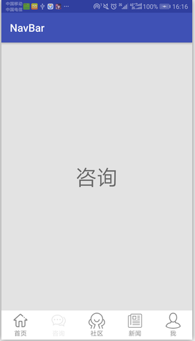

#底部导航

### 简介

    为了实现快速开发以及频繁的需求变更，为此而封装一个扩展性高的底部导航控件。
    
### 应用截图

### 简单用例
####1、xml的使用
```
 <com.zft.navbarlib.FtTabLayout
        android:id="@+id/tab1"
        android:layout_width="match_parent"
        android:layout_height="55dp"
        android:background="#ffffff"
        android:orientation="horizontal">

        <com.zft.navbarlib.FtTab
            android:layout_width="0dp"
            android:layout_height="match_parent"
            android:layout_weight="1"
            app:tab_img_height="30dp"
            app:tab_img_src="@drawable/home"
            app:tab_name="首页"
            app:tab_text_color="@drawable/home_text"
            app:tab_text_size="12sp" />

        <com.zft.navbarlib.FtTab
            android:layout_width="0dp"
            android:layout_height="match_parent"
            android:layout_weight="1"
            app:tab_img_height="30dp"
            app:tab_anim_type="trans"
            app:tab_img_src="@drawable/chat"
            app:tab_name="咨询"
            app:tab_text_color="@drawable/home_text"
            app:tab_text_size="12sp" />
</com.zft.navbarlib.FtTabLayout>
```
####2、Java代码中的使用
```
          FtTabLayout  mTab1 = (FtTabLayout) findViewById(R.id.tab1);
          mTab1.setOnSelectedChangeListener(new FtTabLayout.OnSelectedChangeListener() {
                 @Override
                 public void onSelectedChange(View view, int index) {
          //                选择tab时触发该回调
                      }
                 });
          mTab1.setOnAgainClickListener(new FtTabLayout.OnAgainClickListener() {
                 @Override
                 public void onAgainClicked(View view, int index) {
          //                再次点击已选择的tab时触发该回调
                      }
                  });
;
```